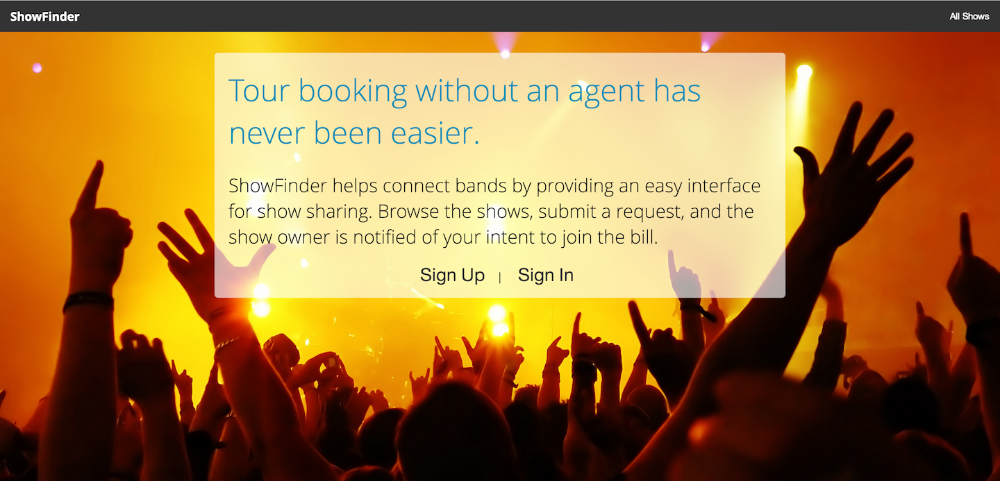

#ShowFinder

Showfinder is a Rails app designed to make tour booking without an agent so much easier by allowing bands to network together through show sharing.



##Gems and APIs Used

- Gmap4Rails
- Geocoder


##Code Snippets
This is the code used to render a map centered on the United States with markers for each show in my database.  

In my view: 

```
<script src="//maps.google.com/maps/api/js?v=3.13&amp;sensor=false&amp;libraries=geometry" type="text/javascript"></script>

<script src='//google-maps-utility-library-v3.googlecode.com/svn/tags/markerclustererplus/2.0.14/src/markerclusterer_packed.js' type='text/javascript'></script>

 <script type="text/javascript">
   window.onload=function(){
        handler = Gmaps.build('Google', { markers: { clusterer: {gridSize: 40,
            maxZoom: 1,}}});
        handler.buildMap({ provider: { center: new google.maps.LatLng(38.5111,-96.8005), zoom: 4  }, internal: {id: 'map'}}, function(){
          markers = handler.addMarkers(<%= raw @hash.to_json %>);
        });
      };
  </script>
```

In my controller: 

```
def show
    @show = Show.find(params[:id])
      @hash = Gmaps4rails.build_markers(@show) do |show, marker|
        
        marker.lat Geocoder.search(show.find_address(show))[0].latitude
        marker.lng Geocoder.search(show.find_address(show))[0].longitude
      end
  end
  
```

##Contact

For any additional information or suggestions, please contact Eric Streske at estreske@gmail.com. 